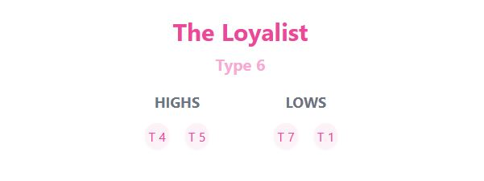
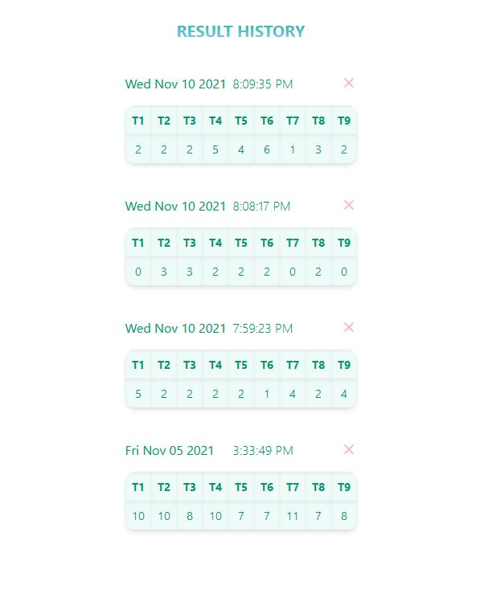
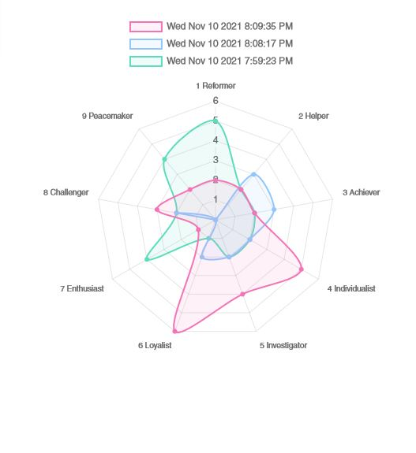

# EN-GRAM


An enneagram personality test that tracks your mental health by comparing the history of your scores with your most recent scores.

<br/>

### Project setup

```
npm install
```

### Compiles and hot-reloads for development

```
npm run serve
```

### Compiles and minifies for production

```
npm run build
```

## Test

<p>Test is taken without an option to return to previous question to discourage overthinking of questions. Users should answer in a timely manner and what first comes to mind.</P>
<p>Demo version has significantly less questions than the real one.</p>


<br/>

## Type Profile

<p>Your core type is the highest scored type.  Your highs are the 2nd and 3rd highest type and your lows are your lowest 2 type.</p>
<p align="center">
  
</p>
<br/>

## Result History

<p>Saved scores of your test results organized from newest to oldest.</P>
<p align="center">
  
</p?
<br/>

## Chart

<p>A radar chart comparing 3 of your latest results to gauge health state.</P>
<p align="center">
  
</p>
<br/>

<br/>
<p>More description of different types coming soon!</p>
